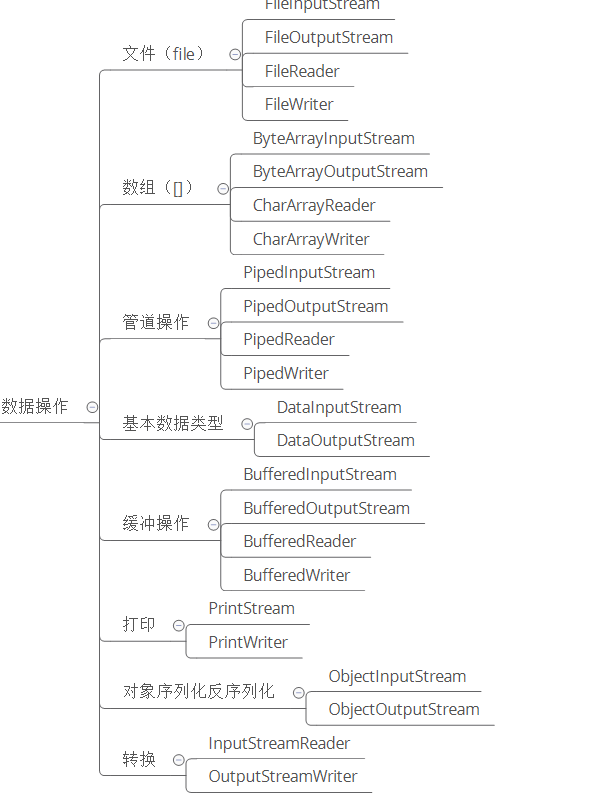

# Java IO知识体系详解

## 知识体系

## IO分类 - 传输

从数据传输方式或者说是运输方式角度看，可以将 IO 类分为:

- 字节流
- 字符流

`字节`是个计算机看的，`字符`才是给人看的

### 字节流和字符流的区别

- 字节流读取单个字节，字符流读取单个字符(一个字符根据编码的不同，对应的字节也不同，如 UTF-8 编码中文汉字是 3 个字节，GBK编码中文汉字是 2 个字节。)
- 字节流用来处理二进制文件(图片、MP3、视频文件)，字符流用来处理文本文件(可以看做是特殊的二进制文件，使用了某种编码，人可以阅读)。

- ### 字节转字符Input/OutputStreamReader/Writer

  编码就是把字符转换为字节，而解码是把字节重新组合成字符。

  如果编码和解码过程使用不同的编码方式那么就出现了乱码。

  - GBK 编码中，中文字符占 2 个字节，英文字符占 1 个字节；
  - UTF-8 编码中，中文字符占 3 个字节，英文字符占 1 个字节；
  - UTF-16be 编码中，中文字符和英文字符都占 2 个字节。

  UTF-16be 中的 be 指的是 Big Endian，也就是大端。相应地也有 UTF-16le，le 指的是 Little Endian，也就是小端。

  Java 使用双字节编码 UTF-16be，这不是指 Java 只支持这一种编码方式，而是说 char 这种类型使用 UTF-16be 进行编码。char 类型占 16 位，也就是两个字节，Java 使用这种双字节编码是为了让一个中文或者一个英文都能使用一个 char 来存储

  

## IO分类 - 操作

