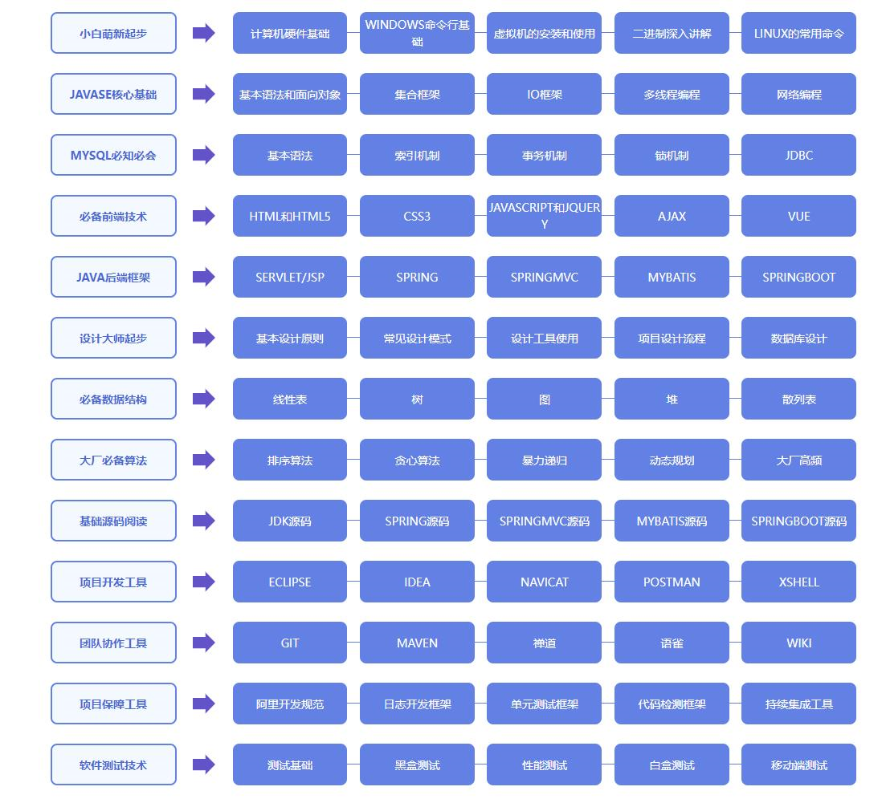

# 计算机硬件基础

## 计算机硬件组成

### 控制器

控制计算机其他硬件的运行

### 运算器

数学运算和逻辑运算

**<u>控制器 + 运算器 = CPU</u>**

### 存储器

#### 内存

如内存条， **存取速度快**，基于电工作，断电数据就丢失，之恶能**临时存储**。所有的数据指令存取都必须经过内存传输。

#### 外存

如硬盘，**存取速度相对内存很慢，数据可以近似“永久”保存**

### 输入设备

### 输出设备

## 三大核心硬件

### CPU

通过程序控制CPU，再通过CPU控制计算机其他硬件，存取指令都来自于内存

#### 精简指令集和复杂指令集

精简指令集： 精简，运行速度快，不容易出错，做复杂的事，要求多个指令完成（常见的有ARM和SPARC架构的，ARM多用与手机、导航系统、网络设备，SPARC常用于学术工作站和银行金融体系服务器）；

复杂指令集： 复杂，运行速度慢，每条指令嗯可以处理更丰富的事（常见的有Intel、AMD的x86架构的，常用于个人PC）

CPU工作流程： **取指-->解码-->执行**

**线程**是CPU的执行单位，**正常CPU都是单个线程，CPU可以保持两个不同的进程来回切换，实现伪并行**（CPU同一时刻还是只能处理一个进程）

**进程**是资源单位

### 内存

RAM：断电后数据消失

ROM：只读内存器，断电不丢失数据，**内含写死的BIOS系统**

CMOS：**特殊的RAM芯片**，存有**BIOS系统配置参数**，时间日期参数等，电池保证数据不丢失

### 硬盘

机械硬盘（HDD）

扇区：硬盘最小的读写单位，1扇区相当于512字节Bytes

block块：操作系统最小的读写单位，****

